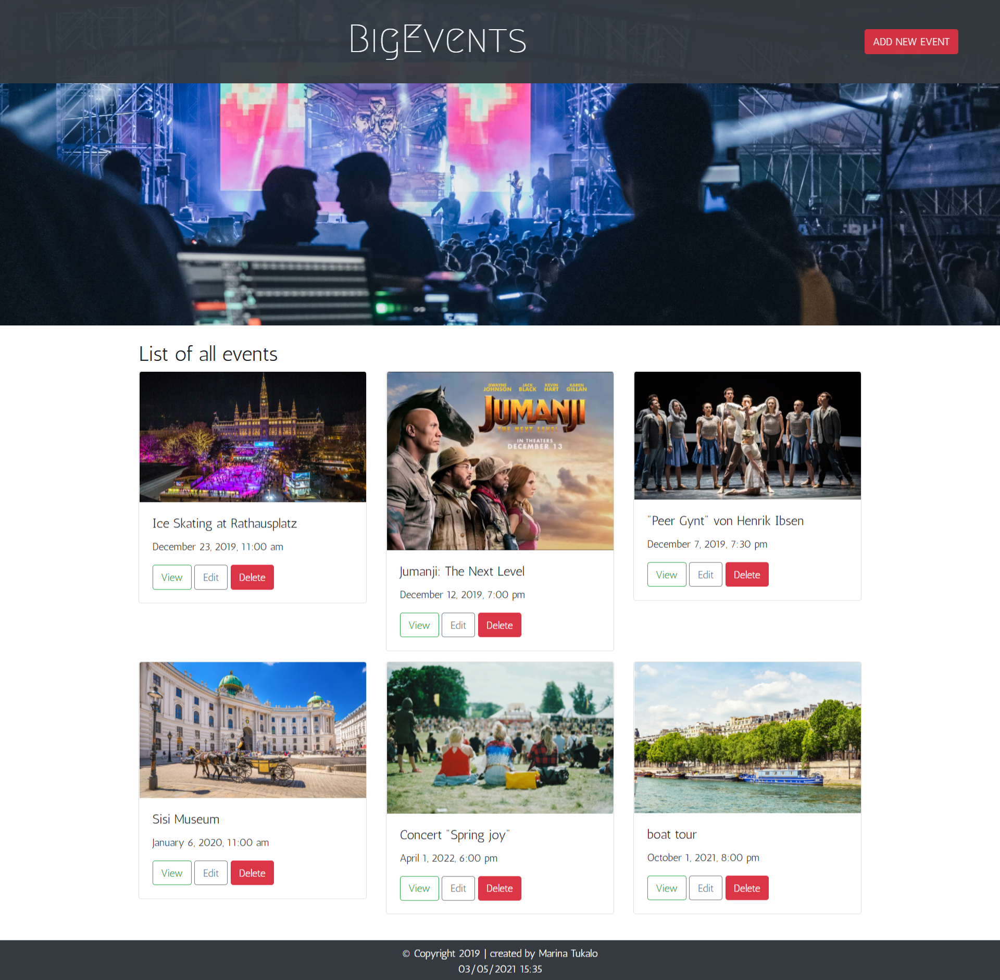
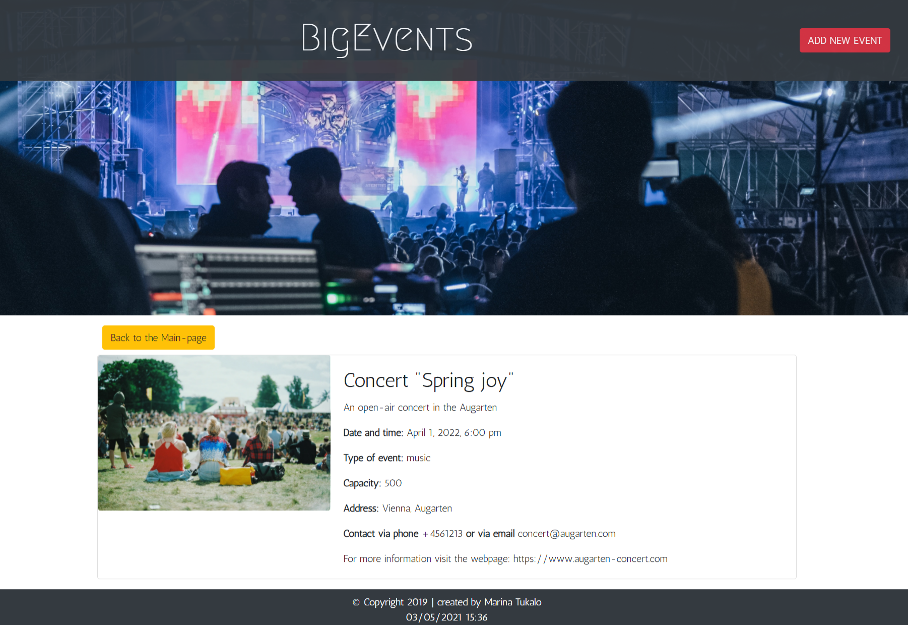
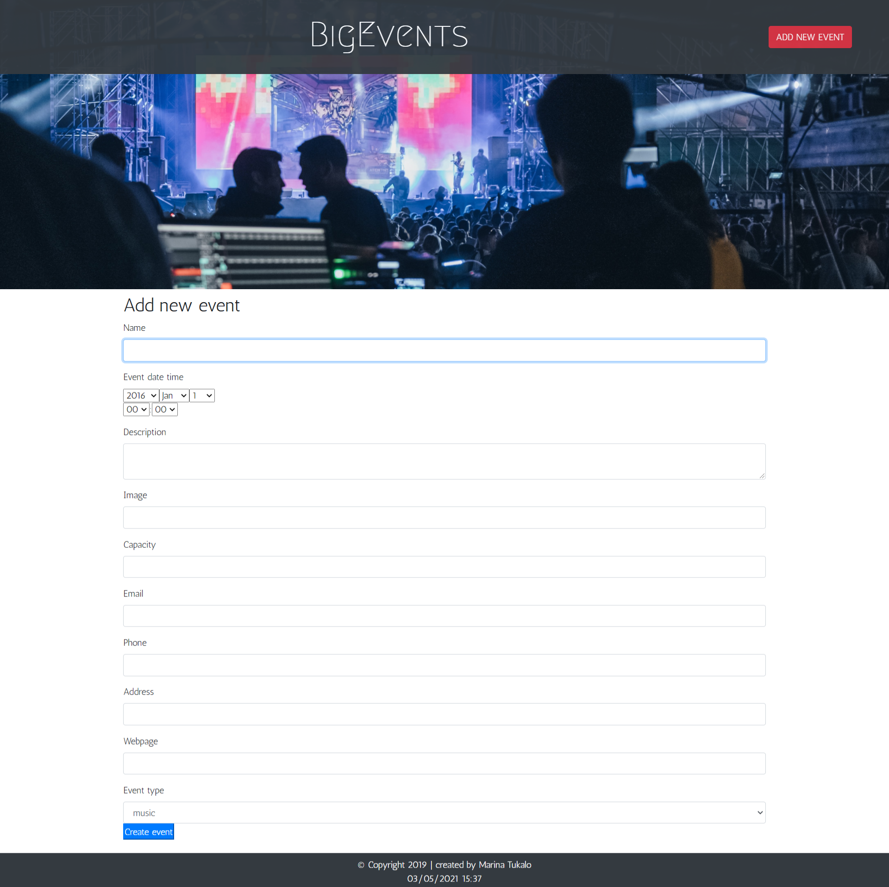

# Bootcamp: Symfony CodeReview-13 "BigEvents"

  

  
Layout of "See more" & "Add new event" pages

   "See more" page  
  

    
  

   "Add new event" page  
  

    
  

A website "BigEvent" for an event management company that needs to track events in a local area. 

The application is created with the framework **Symfony**. 

The data is used in the **MySQL** database.

The user can create, update and delete an event.

// Disclaimer: The whole website is for educational purposes only //

